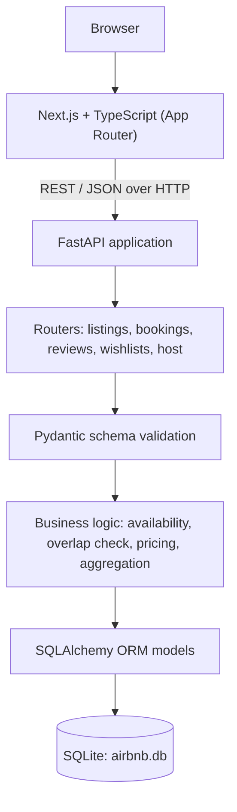
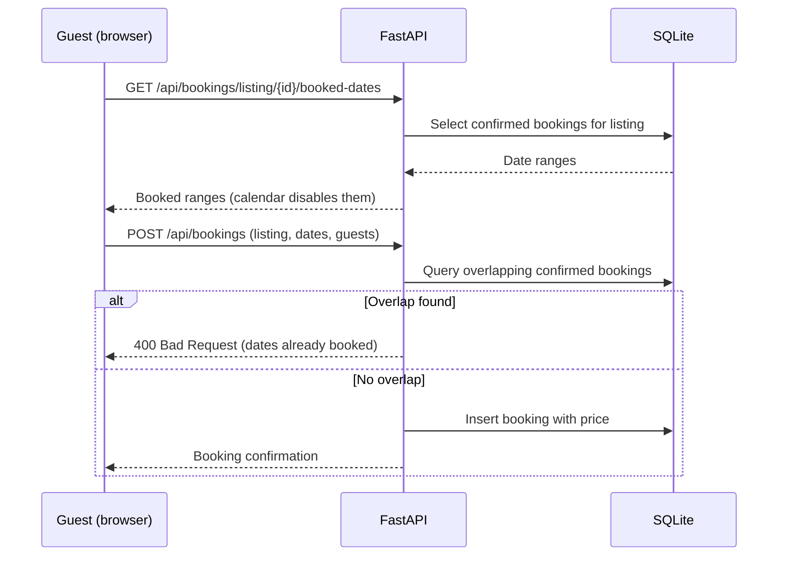
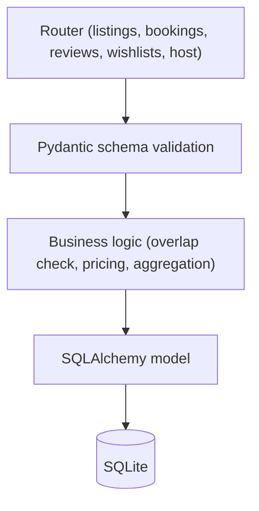

# Airbnb Clone — Full-Stack Booking Platform

A marketplace-style booking platform built with a Next.js (TypeScript) frontend and a FastAPI backend backed by a relational SQLite database. Guests can discover properties, search and filter by destination, dates, guests, price and amenities, check date availability, and reserve a stay. Hosts can create, edit and delete listings and review bookings and revenue from a dashboard.

The core of the system is the reservation workflow. Availability is derived from persisted booking records, and every reservation request is validated on the server against existing bookings before it is stored. Around that sit a relational data model with six tables, a modular FastAPI backend (routers, Pydantic schemas, SQLAlchemy models), host-side listing CRUD, wishlists, reviews, and an automated backend API test suite.

The application starts with seeded data (users, listings, images, bookings and reviews), so every flow can be evaluated immediately after setup without manual data entry.

---

## Table of Contents

- [Project Highlights](#project-highlights)
- [Links](#links)
- [Core Features](#core-features)
- [Feature and Implementation Map](#feature-and-implementation-map)
- [Technology Stack](#technology-stack)
- [System Architecture](#system-architecture)
- [Database Design](#database-design)
- [Booking and Availability Logic](#booking-and-availability-logic)
- [Pricing Logic](#pricing-logic)
- [REST API](#rest-api)
- [Validation Strategy](#validation-strategy)
- [Engineering Challenges and Solutions](#engineering-challenges-and-solutions)
- [Frontend Architecture](#frontend-architecture)
- [Backend Architecture](#backend-architecture)
- [Project Structure](#project-structure)
- [Testing](#testing)
- [Seed Data](#seed-data)
- [UI / UX](#ui--ux)
- [Security and Validation Considerations](#security-and-validation-considerations)
- [Assumptions and Trade-offs](#assumptions-and-trade-offs)
- [What I Would Improve for Production](#what-i-would-improve-for-production)
- [Scalability Considerations](#scalability-considerations)
- [Getting Started](#getting-started)
- [Assignment Requirements](#assignment-requirements)
- [Interview Talking Points](#interview-talking-points)
- [Author](#author)

---

## Project Highlights

- Full-stack architecture with a clear boundary: Next.js owns presentation and interaction state, FastAPI owns business rules and persistence.
- REST API organised by resource (listings, bookings, reviews, wishlists, host) with one router module per resource.
- Relational schema with six tables and foreign-key relationships between users, listings, images, bookings, reviews and wishlists.
- Booking workflow with server-side availability validation. Overlapping reservations are rejected with an HTTP 400 response, regardless of what the client sent.
- Availability calendar driven by persisted bookings, so booked dates are blocked in the date picker and re-checked on the server.
- Full listing CRUD for hosts, with image records stored in a separate table.
- Search and filtering by keyword, category, price range, dates and amenities, with paginated results.
- Wishlist persisted in the database, with optimistic UI updates on the client.
- Reviews with an overall rating and per-category scores.
- Host dashboard aggregating active listings, bookings, gross revenue and average rating.
- Responsive UI with mobile navigation, a map view, and a light/dark theme.
- Automated backend test suite covering health, search, availability, overlap rejection, booking, cancellation, wishlist and host dashboard.
- Database seeded on first launch, so the application is usable immediately.

---

## Links

| Resource | Location |
|---|---|
| Live Demo | https://airbnb-fullstack-assignment-pi.vercel.app/ |
| GitHub Repository | https://github.com/aarzusharma07/airbnb-fullstack-assignment |
| API Documentation | `http://localhost:8000/docs` (Swagger UI, available when the backend is running locally) |

---

## Core Features

### Guest Experience

| Feature | Engineering purpose |
|---|---|
| Property discovery feed | Paginated listing retrieval from the API, rendered as a photo-first grid |
| Category bar | Server-side filtering by listing category |
| Search modal | Captures location, check-in/check-out dates and guest counts in shared client state, then queries the API |
| Filter modal | Price range, property types and amenities passed as query parameters |
| Listing detail page | Single-resource fetch returning listing data, host profile and image gallery |
| Availability calendar | Fetches booked date ranges from the API and disables them in the date picker |
| Guest selection and price breakdown | Shows nightly price, nights, cleaning fee and service fee before booking |
| Booking and mock checkout | Creates a reservation through the API; payment is simulated |
| My Trips | Lists a user's reservations and supports cancellation |
| Wishlist | Persists saved listings; heart toggle updates optimistically |
| Reviews | Overall rating and per-category scores, with a review submission form |
| Notifications | Toast feedback for bookings, cancellations, reviews and wishlist actions |

### Host Experience

| Feature | Engineering purpose |
|---|---|
| Host dashboard | Aggregated metrics: active listings, total bookings, gross revenue, average rating |
| Create listing | Form-driven POST to the listings resource |
| Edit listing | PUT to update pricing, capacity, amenities and details |
| Delete listing | DELETE with related image records removed |
| Image management | Listing photos added by URL or local file preview |
| Bookings management | Table of incoming reservations with guest, dates, status and payout |

### Additional Features

| Feature | Description |
|---|---|
| Interactive map | Leaflet map with price markers and a map/list toggle |
| Dark mode | Light/dark theme with the preference stored in `localStorage` |
| Superhost information | Host profiles carry superhost status |
| Guest favourite badge | Shown for listings with a rating of 4.95 or higher |
| Total price toggle | Switches the feed between nightly and total price |
| Mobile bottom navigation | Fixed navigation bar for small viewports |
| Role switcher | Switches between a demo guest and a demo host for evaluation |
| Messaging interface | Frontend chat view between guest and host. No message endpoints are part of the documented API, so this is a UI-level feature |

---

## Feature and Implementation Map

| Area | Capability | Implementation |
|---|---|---|
| Search | Location, dates, guests, price, amenities | Client-side search state + `GET /api/listings` query parameters |
| Categories | Category filtering | Query parameter on the listings endpoint |
| Availability | Detect existing bookings | `GET /api/bookings/listing/{id}/booked-dates` + FastAPI + SQLite |
| Booking | Reservation creation | `POST /api/bookings` with server-side overlap validation |
| Cancellation | Cancel a reservation | `DELETE /api/bookings/{id}` |
| Wishlist | Save and remove properties | `wishlists` table + toggle endpoint |
| Host management | Listing CRUD | FastAPI routers + SQLAlchemy models |
| Reviews | Ratings and comments | `reviews` table + review endpoints |
| Host analytics | Revenue and booking metrics | `GET /api/host/dashboard` aggregation |
| Maps | Location view | Leaflet / React-Leaflet using listing coordinates |
| Notifications | User feedback | react-hot-toast |

---

## Technology Stack

| Layer | Technology | Why it is used |
|---|---|---|
| Frontend framework | Next.js 16 (App Router) | File-based routing, dynamic routes such as `/rooms/[id]`, shared layouts |
| Frontend language | TypeScript 5 | Typed API contracts and component props reduce integration bugs |
| Styling | Tailwind CSS 4 | Utility-first responsive styling and theme variables |
| Date handling | date-fns | Night counts, formatting and range handling without a heavy date library |
| Maps | Leaflet, React-Leaflet | Open-source map rendering with custom price markers, no paid map API |
| Notifications | react-hot-toast | Lightweight toast feedback for user actions |
| Icons | Lucide React | Consistent icon set for navigation, categories and amenities |
| Backend framework | Python 3.10+, FastAPI | Typed request handling, router modularity, automatic OpenAPI documentation |
| Validation | Pydantic v2 | Declarative request and response schemas |
| ORM | SQLAlchemy 2.0 | Relational mapping, queries, foreign keys and relationships |
| Database | SQLite | Zero-configuration relational database that keeps setup simple for evaluators |
| Testing | `unittest`, HTTPX | API-level tests against the running application |

---

## System Architecture



### Frontend Layer

The frontend owns routing, rendering and interaction state. It keeps the demo session, search criteria and wishlist state in React contexts, builds API requests, disables unavailable dates in the calendar for a better user experience, and presents toast feedback. It does not own any rule that protects data integrity.

### API Layer

FastAPI exposes the REST endpoints, applies CORS configuration, and routes requests to resource-specific routers. Request and response bodies are described by Pydantic schemas, and the interactive documentation is generated from them.

### Business Logic

The backend is the authority for booking rules: date-range overlap detection, rejection of conflicting reservations, total price calculation, and host dashboard aggregation (revenue, bookings, average rating).

### Persistence Layer

SQLAlchemy maps Python models to six SQLite tables and handles queries and relationships. The database file is `backend/airbnb.db`, populated on first launch by the seed logic.

---

## Database Design

The data model is relational because the domain consists of entities with clear, enforceable relationships: hosts own listings, guests make bookings against listings, and reviews and wishlist entries link users to listings. The database contains six tables: `users`, `listings`, `listing_images`, `bookings`, `reviews` and `wishlists`.


### Relationship Design

| Relationship | Cardinality | Foreign key | Meaning |
|---|---|---|---|
| users to listings | one to many | `listings.host_id` | A host account owns many listings |
| users to bookings | one to many | `bookings.user_id` | A guest makes many bookings |
| listings to bookings | one to many | `bookings.listing_id` | A listing receives many reservations over time |
| listings to listing_images | one to many | `listing_images.listing_id` | A listing has an ordered set of photos, one marked as cover |
| users to reviews | one to many | `reviews.user_id` | A guest writes many reviews |
| listings to reviews | one to many | `reviews.listing_id` | A listing collects many reviews |
| users to wishlists | one to many | `wishlists.user_id` | A user saves many listings |
| listings to wishlists | one to many | `wishlists.listing_id` | A listing can be saved by many users |

Taken together, `wishlists` is an association table that implements a many-to-many relationship between users and listings. Deleting a listing removes its dependent image and booking records through cascade rules defined on the models.

<!-- VERIFY before publishing: confirm cascade settings on Listing relationships in backend/app/models/listing.py, and whether any unique constraint exists on (user_id, listing_id) in wishlists. -->

---

## Why This Database Design?

- **Listings and images are separate tables.** A listing has a variable number of photos. A child table with `display_order` and `is_cover` avoids repeated columns or serialised blobs, and lets images be added, reordered or removed independently.
- **Bookings reference both user and listing.** A reservation is a fact connecting a guest, a property and a date range. Two foreign keys make it possible to answer both "who booked this listing" (host view, availability) and "what has this user booked" (My Trips) with simple queries.
- **Bookings store the price they were made at.** `nightly_price` and `total_price` are saved on the booking, so a later change to a listing's price does not rewrite history.
- **Reviews reference both user and listing.** This attributes each review to an author and a property, and allows per-listing aggregation of scores.
- **Wishlist entries are their own table.** Saved state is per user and per listing. An association table models this without duplicating user or listing data.
- **Foreign keys enforce integrity.** Every booking, review, image and wishlist row must point to existing parents, which prevents orphan records.
- **Persisted bookings are the source of availability.** Availability is not stored as a flag. It is derived from confirmed booking rows, so there is a single source of truth that cannot drift from the reservations.

---

## Booking and Availability Logic

### Booking flow

1. The guest opens a listing and chooses check-in and check-out dates.
2. The frontend requests the booked date ranges for the listing.
3. The backend returns confirmed reservations for that listing.
4. The calendar disables dates that fall inside those ranges.
5. The guest confirms the booking, and the frontend sends `POST /api/bookings`.
6. The backend validates the payload, then checks the requested range against existing confirmed bookings.
7. If any reservation overlaps, the request is rejected with HTTP 400.
8. Otherwise the backend calculates the price and persists the booking.
9. The new range now appears in the booked dates, so it is unavailable to future requests.



### Overlap rule

Two date ranges overlap when each one starts before the other ends:

```text
existing_start < requested_end
AND
existing_end > requested_start
```

Check-out and check-in on the same day do not conflict, because the comparison is strict. Example for one listing with an existing booking from 10 to 15:

| Requested range | Overlaps with 10 to 15? | Reason |
|---|---|---|
| 12 to 14 | Yes | Starts and ends inside the existing range |
| 8 to 11 | Yes | Ends after the existing start |
| 14 to 18 | Yes | Starts before the existing end |
| 15 to 18 | No | Starts exactly when the existing booking ends |
| 5 to 10 | No | Ends exactly when the existing booking starts |

The rule is implemented as a database query in `backend/app/routers/bookings.py`:

```python
overlapping_booking = db.query(Booking).filter(
    Booking.listing_id == booking_in.listing_id,
    Booking.status == "confirmed",
    Booking.start_date < booking_in.end_date,
    Booking.end_date > booking_in.start_date
).first()

if overlapping_booking:
    raise HTTPException(
        status_code=400,
        detail="These dates are already booked for this listing. Please select different dates."
    )
```

### Why validation happens on the server

Frontend validation improves the user experience: the calendar greys out unavailable dates and users get fast feedback. It cannot be the only protection, because the client can be stale (another guest may have booked since the page loaded), can be bypassed by calling the API directly, and can be modified by the user. The backend validation is what protects the business rule that a property cannot be booked twice for the same night.

---

## Pricing Logic

The total price of a reservation is calculated on the backend:

```text
total price = (price per night x number of nights) + cleaning fee + service fee
```

- `price_per_night`, `cleaning_fee` and `service_fee` are stored on the listing.
- The booking stores `nightly_price` and `total_price`, so the amount charged at booking time is preserved.
- The frontend shows the same breakdown in the reservation widget and checkout modal so the guest sees the cost before confirming.

---

## REST API

Interactive documentation is generated by FastAPI at `http://localhost:8000/docs`.

### Listings

| Method | Endpoint | Purpose |
|---|---|---|
| GET | `/api/listings` | Search and filter listings (pagination, category, keyword, price range, dates, amenities) |
| GET | `/api/listings/{id}` | Listing details with host profile and images |
| POST | `/api/listings` | Create a listing |
| PUT | `/api/listings/{id}` | Update a listing |
| DELETE | `/api/listings/{id}` | Delete a listing and its dependent records |

### Bookings

| Method | Endpoint | Purpose |
|---|---|---|
| GET | `/api/bookings/listing/{id}/booked-dates` | Confirmed date ranges for a listing |
| POST | `/api/bookings` | Create a booking with overlap validation |
| GET | `/api/bookings/my` | Reservations for the current user |
| DELETE | `/api/bookings/{id}` | Cancel a reservation |

### Reviews

| Method | Endpoint | Purpose |
|---|---|---|
| GET | `/api/reviews/listing/{id}` | Reviews and aggregated ratings for a listing |
| POST | `/api/reviews/listing/{id}` | Submit a review |

### Wishlists

| Method | Endpoint | Purpose |
|---|---|---|
| GET | `/api/wishlists` | Saved listings for a user |
| POST | `/api/wishlists/toggle` | Save or remove a listing |

### Host

| Method | Endpoint | Purpose |
|---|---|---|
| GET | `/api/host/dashboard` | Active listings, bookings, gross revenue and average rating |

### System

| Method | Endpoint | Purpose |
|---|---|---|
| GET | `/` | API status |
| GET | `/api/health` | Health check |
| GET | `/api/users` | Demo accounts used by the role switcher |

### Design principles

- Resource-oriented routes, with HTTP methods mapped to read, create, update and delete operations.
- JSON request and response bodies described by Pydantic schemas.
- Business-rule failures return an HTTP error with a readable `detail` message, which the frontend surfaces as a toast.
- One router module per resource, registered in the application entry point.

---

## Validation Strategy

Validation happens in layers, each with a different responsibility:

```text
Frontend validation  ->  API schema validation  ->  Business rule validation  ->  Database constraints
```

| Layer | Responsibility | Example |
|---|---|---|
| Frontend | Immediate user feedback | Calendar disables booked dates; forms check required fields |
| Pydantic schemas | Shape and types of request data | Correct field types for a booking or listing payload |
| Business rules | Domain constraints that need data | Requested dates must not overlap a confirmed booking |
| Database | Structural integrity | Primary keys, foreign keys, unique email |

Request validation tells the client the payload is well formed. Business validation decides whether a well-formed request is allowed given the current state of the data. The database layer is the last line of defence for structural integrity.

---

## Engineering Challenges and Solutions

### Challenge 1: Preventing double bookings

Date-range conflicts are easy to get wrong because partial overlaps, containment and back-to-back stays all behave differently. A frontend-only check is insufficient because the page can be stale or bypassed. The backend applies the strict-inequality overlap rule against confirmed bookings and rejects conflicts with HTTP 400. A dedicated test verifies this behaviour.

### Challenge 2: Availability calendar

Booked ranges are served by a dedicated endpoint. The frontend converts them into disabled dates in the picker, so users cannot easily select an unavailable range. The backend still validates on submission, so it remains the authority if the client's view is out of date.

### Challenge 3: Relational data modelling

The domain has several related entities: users, listings, images, bookings, reviews and wishlists. Each relationship is modelled with a foreign key, images and wishlist entries are separate tables, and bookings keep the price captured at booking time. The resulting schema supports availability, My Trips, host dashboards and per-listing review aggregation with straightforward queries.

### Challenge 4: Full listing CRUD

Hosts can create, read, update and delete listings. Create and update go through Pydantic-validated payloads, changes are persisted through SQLAlchemy, and deletion removes dependent records. The same form component is reused for creating and editing.

### Challenge 5: Frontend and backend separation

Presentation and interaction state live in Next.js. Anything that protects data or defines a business rule, such as overlap detection and price calculation, lives in FastAPI. This keeps the rules enforceable no matter which client calls the API.

### Challenge 6: Seed data

A marketplace needs listings, hosts, photos, bookings and reviews to be meaningfully evaluated. Seeding on first launch makes search, availability, overlap rejection and the host dashboard testable immediately, and gives the test suite known data.

---

## Frontend Architecture

The frontend uses the Next.js App Router with TypeScript, under `frontend/src`.

| Area | Location | Responsibility |
|---|---|---|
| Routes | `src/app` | `/` explore feed, `/rooms/[id]` listing detail, `/trips`, `/wishlists`, `/messages`, `/host/dashboard`, `/host/create`, `/host/edit/[id]` |
| Layout | `src/app/layout.tsx` | Root layout that wraps the app in context providers |
| Components | `src/components` | Reusable UI grouped by domain: layout, listings, booking, host, reviews, map, auth |
| Contexts | `src/context` | `AuthContext` (demo guest/host session), `SearchContext` (filters, dates, guests), `WishlistContext` (saved listings with optimistic updates) |
| API and utilities | `src/lib` | API client and date helpers |
| Types | `src/types` | Shared TypeScript declarations for API data |

State is managed with React context and component state. Forms are controlled components, and `ListingForm` is shared by the create and edit pages. Reusable components such as `ListingCard`, `ListingGrid`, `PhotoGallery` and `ReservationWidget` keep rendering logic in one place rather than duplicated across pages.

---

## Backend Architecture



| Component | File or folder | Responsibility |
|---|---|---|
| Entry point | `backend/app/main.py` | Creates the FastAPI app, configures CORS, registers routers, runs seeding on first launch |
| Configuration | `backend/app/config.py` | CORS origins and database URL |
| Database layer | `backend/app/database.py` | SQLAlchemy engine, session factory and declarative base |
| Models | `backend/app/models` | One file per table |
| Schemas | `backend/app/schemas` | Pydantic request and response models |
| Routers | `backend/app/routers` | Endpoint handlers per resource |
| Seeding | `backend/app/seed_data.py` | Populates demo data |
| Utilities | `backend/inspect_db.py` | Prints database tables for inspection |
| Tests | `backend/test_backend.py` | API test suite |
| Runner | `backend/run.py` | Starts the backend locally |

---

## Project Structure

```text
airbnb-fullstack-assignment/
├── backend/
│   ├── app/
│   │   ├── config.py
│   │   ├── database.py
│   │   ├── main.py
│   │   ├── seed_data.py
│   │   ├── models/
│   │   │   ├── user.py
│   │   │   ├── listing.py
│   │   │   ├── listing_image.py
│   │   │   ├── booking.py
│   │   │   ├── review.py
│   │   │   └── wishlist.py
│   │   ├── routers/
│   │   │   ├── listings.py
│   │   │   ├── bookings.py
│   │   │   ├── reviews.py
│   │   │   ├── wishlists.py
│   │   │   └── host.py
│   │   └── schemas/
│   ├── airbnb.db
│   ├── inspect_db.py
│   ├── test_backend.py
│   ├── requirements.txt
│   └── run.py
├── frontend/
│   ├── public/
│   ├── src/
│   │   ├── app/
│   │   │   ├── rooms/[id]/
│   │   │   ├── trips/
│   │   │   ├── wishlists/
│   │   │   ├── messages/
│   │   │   └── host/
│   │   ├── components/
│   │   │   ├── layout/
│   │   │   ├── listings/
│   │   │   ├── booking/
│   │   │   ├── host/
│   │   │   ├── reviews/
│   │   │   ├── map/
│   │   │   └── auth/
│   │   ├── context/
│   │   ├── lib/
│   │   └── types/
│   ├── package.json
│   └── tsconfig.json
├── render.yaml
├── .gitignore
└── README.md
```

| Folder | Purpose |
|---|---|
| `backend/app/models` | SQLAlchemy table definitions |
| `backend/app/routers` | HTTP endpoints grouped by resource |
| `backend/app/schemas` | Pydantic validation and serialisation models |
| `frontend/src/app` | Next.js routes |
| `frontend/src/components` | Reusable UI components grouped by domain |
| `frontend/src/context` | Shared client state providers |
| `frontend/src/lib` | API client and date utilities |

---

## Testing

The backend test suite is in `backend/test_backend.py` and exercises the API endpoints.

| Test area | What is verified |
|---|---|
| Health check | `/api/health` returns HTTP 200 with a healthy status |
| Listing retrieval | Listings endpoint returns the seeded properties |
| Category filtering | Filtering by category returns matching listings |
| Search | Keyword search returns matching destinations |
| Listing details | Detail response includes images and host information |
| Booked dates | Booked date endpoint returns existing reservations |
| Overlap rejection | A booking that overlaps an existing one returns HTTP 400 |
| Booking creation | A valid, non-overlapping booking succeeds |
| Cancellation | Cancelling a reservation removes it |
| Wishlist | Saving and removing a listing works through the toggle |
| Host dashboard | Dashboard returns correct revenue and listing metrics |

Run the tests from the repository root:

```powershell
cd backend
python test_backend.py
```

---

## Seed Data

The database is initialised automatically on the first backend launch by `seed_data.py`. To inspect it:

```powershell
cd backend
python inspect_db.py
```

| Entity | Seeded content |
|---|---|
| Users | 5 demo users: one guest account and four hosts, with superhost status |
| Listings | 16 properties across multiple countries and categories |
| Listing images | 80 images, five per property |
| Bookings | Pre-configured reservations that block calendar dates |
| Reviews | Reviews with category scores and comments |

Seed data matters for evaluation because each feature, from search and availability to the host dashboard, has realistic data to work with immediately. It also gives the tests a known starting state.

---

## UI / UX

- **Photo-first discovery.** The feed and cards lead with property imagery, followed by location, price and rating.
- **Search-first navigation.** Location, dates and guests are captured in a single search flow and shared across pages through context.
- **Responsive layout.** Property grids adapt to screen size, and a fixed bottom navigation bar is used on mobile.
- **Date picker with availability.** Booked dates are disabled so users can pick valid ranges.
- **Booking summary and price breakdown.** Nightly price, nights, cleaning fee and service fee are shown before checkout.
- **Toast feedback.** Booking, cancellation, review and wishlist actions give immediate confirmation or error messages.
- **Guest and host separation.** Host pages (dashboard, create, edit) are distinct from guest pages, with a role switcher for demos.
- **Map and list views.** Users can toggle between a grid of results and a map with price markers.
- **Theme support.** Light and dark themes, with the preference remembered.

---

## Security and Validation Considerations

This is an assignment-level implementation. The table separates what is implemented from what a production system would require.

| Area | Current implementation | Production requirement |
|---|---|---|
| Booking validation | Server-side overlap check before insert | Same rule inside a transaction with concurrency control |
| Input validation | Pydantic schemas on request bodies | Same, plus stricter business constraints and sanitisation |
| CORS | Allowed origins configured in `config.py` | Restrict to deployed frontend origins |
| Authentication | Demo users selected on the client; no passwords, tokens or sessions | Real authentication (JWT or sessions) and password hashing |
| Authorisation | Host and guest roles follow the demo user | Server-enforced role and ownership checks on every endpoint |
| Payments | Mocked checkout; no payment data is processed | Payment gateway integration with webhooks |

The demo authentication model means that user identity is not cryptographically verified. It exists to make the guest and host flows easy to evaluate, and it should not be treated as secure.

---

## Assumptions and Trade-offs

| Decision | Reason | Production alternative |
|---|---|---|
| Mocked payments | Focus the assignment on the booking workflow | Stripe or similar gateway with webhook handling |
| Demo role switching | Lets evaluators test guest and host flows without sign-up | JWT or session authentication with roles |
| SQLite | No external server needed, easy setup | PostgreSQL with migrations |
| Images stored as URLs | Simple and portable for a demo | Object storage (S3 or Cloudinary) with a CDN |
| Messaging as a frontend interface | Shows the UX without building a messaging backend | Persisted messages delivered over WebSockets |
| OpenStreetMap with Leaflet | Free, no API key required | Managed maps provider if clustering and geocoding are needed |
| Overlap check at application level | Clear and testable business rule | Transactional locking or a database-level constraint |

---

## What I Would Improve for Production

These are future improvements and are not implemented in this project.

- PostgreSQL with Alembic migrations.
- Transactional reservation handling with row-level locking or a database constraint to prevent concurrent double bookings.
- JWT or session authentication, password hashing, and role-based authorisation.
- Payment gateway integration.
- Object storage and a CDN for listing images.
- Redis caching for hot reads such as the listing feed.
- WebSockets for real-time messaging.
- Background jobs for emails and notifications.
- Rate limiting, structured logging and monitoring.
- CI/CD pipeline and automated frontend tests.
- API versioning.

---

## Scalability Considerations

| Concern | What would change at scale |
|---|---|
| Database indexing | Index `bookings(listing_id, start_date, end_date)` for the overlap query, and index listing filter columns such as city, category and price |
| Pagination | Keep listing results paginated, moving to cursor-based pagination for large datasets |
| Caching | Cache popular search results and listing detail responses in Redis |
| Images | Serve photos from object storage behind a CDN rather than from listing URLs |
| Database scaling | Move to PostgreSQL, add read replicas for read-heavy browse traffic |
| API scaling | Run multiple stateless API instances behind a load balancer |
| Reservation concurrency | Perform the overlap check and insert in one transaction with locking, or use a database exclusion constraint on date ranges |
| Background work | Offload notifications and aggregation to a job queue |
| Rate limiting | Protect search and booking endpoints from abuse |

The booking path is the most sensitive to scale. The current check-then-insert approach is correct for sequential requests, but under heavy concurrent traffic two requests for the same dates could both pass the check before either inserts. Making the check and insert atomic is the primary change required for production.

---

## Getting Started

### Prerequisites

- Python 3.10 or higher
- Node.js 18 or higher
- npm 9 or higher

### Backend Setup

```powershell
cd backend
python -m venv venv
.\venv\Scripts\activate
pip install -r requirements.txt
python run.py
```

The API runs at `http://localhost:8000` and Swagger documentation is at `http://localhost:8000/docs`.

### Frontend Setup

Open a second terminal:

```powershell
cd frontend
npm install
npm run dev
```

The application runs at `http://localhost:3000`.

### Environment Variables

The frontend reads the API base URL from `frontend/.env.local`. If omitted, it falls back to the local backend.

```env
NEXT_PUBLIC_API_URL=http://localhost:8000/api
```

### Running the Application

1. Start the backend (`python run.py` inside `backend`). The database is created and seeded on first launch.
2. Start the frontend (`npm run dev` inside `frontend`).
3. Open `http://localhost:3000`.

### Running Tests

```powershell
cd backend
python test_backend.py
```

---

## Assignment Requirements

| Requirement | Status | Implementation |
|---|---|---|
| Next.js + TypeScript | Implemented | Next.js App Router frontend written in TypeScript |
| FastAPI backend | Implemented | Routers, Pydantic schemas, SQLAlchemy models |
| SQLite database | Implemented | Six-table relational schema in `airbnb.db` |
| Home and search | Implemented | Explore feed, categories, search modal, filters |
| Listing detail | Implemented | `/rooms/[id]` with gallery, host info, amenities |
| Availability | Implemented | Booked-dates endpoint + disabled dates in calendar |
| Booking | Implemented | `POST /api/bookings` with overlap validation |
| My Trips | Implemented | `/trips` with reservation list and cancellation |
| Host CRUD | Implemented | Create, edit and delete listings |
| Host dashboard | Implemented | `/host/dashboard` backed by `GET /api/host/dashboard` |
| Wishlist | Implemented | `/wishlists` + persisted toggle endpoint |
| Reviews | Implemented | Review listing and submission endpoints |
| Notifications | Implemented | Toast notifications for user actions |
| Responsive UI | Implemented | Responsive grids and mobile bottom navigation |
| Seed data | Implemented | Automatic seeding on first launch |
| Database schema | Implemented | ER diagram and relationships documented above |
| API | Implemented | REST endpoints with Swagger documentation |
| README and documentation | Implemented | This document |

---
## Author

Aarzu Sharma
Full-stack assignment submission
