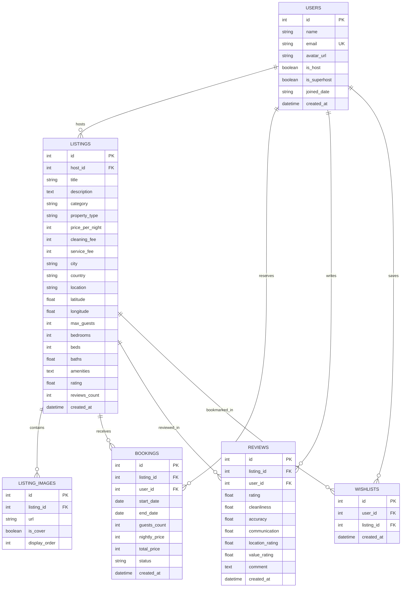
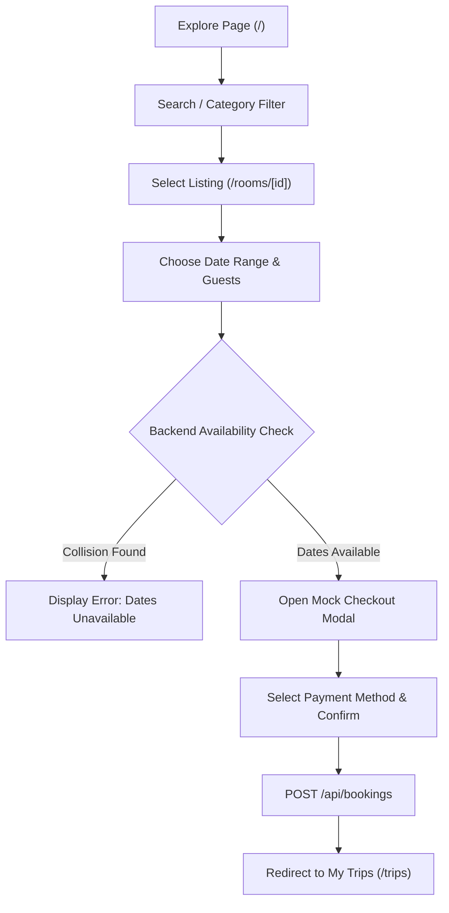
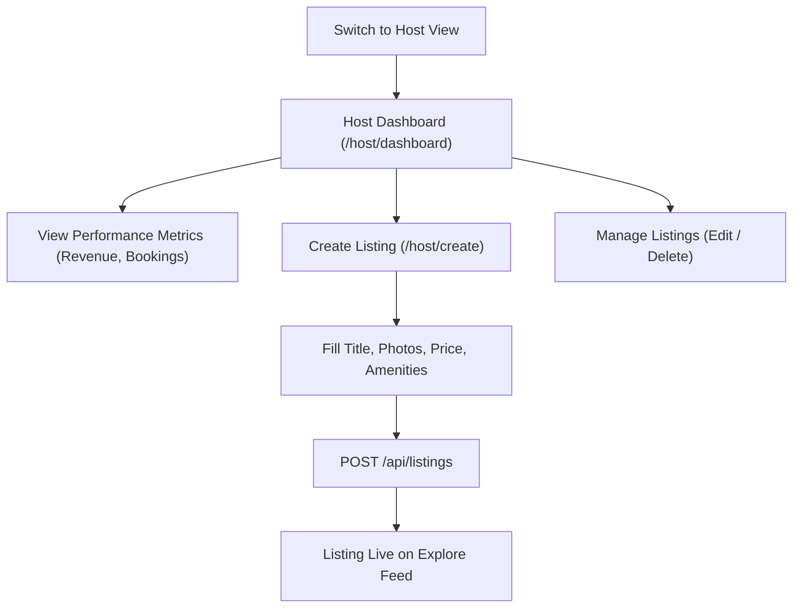

# Airbnb Clone — Full-Stack Booking Platform

A full-stack web application replicating Airbnb's core marketplace experience, browse workflows, search engine, reservation system, and host management suite. The platform enables guests to discover stays across global destinations, filter by criteria, check real-time date availability, and complete reservations with price calculations. Hosts can create, edit, and delete property listings and monitor revenue through an analytics dashboard.

---

## Overview

### Key User Journeys

**Guest Journey:**
$$\text{Explore} \longrightarrow \text{Search / Filter} \longrightarrow \text{Listing Details} \longrightarrow \text{Select Dates \& Guests} \longrightarrow \text{Mock Checkout} \longrightarrow \text{My Trips}$$

**Host Journey:**
$$\text{Host View} \longrightarrow \text{Host Dashboard} \longrightarrow \text{Create Listing Wizard} \longrightarrow \text{Edit / Delete} \longrightarrow \text{Track Bookings \& Revenue}$$

---

## Features

### Guest Features

| Feature | Description | Status |
|---|---|---|
| **Explore Feed** | Photo-forward grid displaying property photos, titles, location, price per night, and rating badges. | Implemented |
| **Category Filter Bar** | Horizontally scrollable bar covering categories (Mansions, Cabins, Beachfront, Amazing pools, Treehouses, Lakefront, Countryside, Skiing, Islands, Iconic cities). | Implemented |
| **Search Modal** | 3-way modal filtering by location keyword, check-in/check-out date ranges, and guest count (Adults, Children, Infants). | Implemented |
| **Granular Filters** | Filter modal for price range slider (min/max), property types, and amenities checklist. | Implemented |
| **Listing Detail View** | 5-photo mosaic gallery, host profile, property amenities, sleeping arrangements, and AirCover details. | Implemented |
| **Date Availability Calendar** | Interactive date picker that retrieves confirmed reservations from the API and blocks unavailable dates. | Implemented |
| **Price Breakdown** | Live calculation of nightly rate $\times$ nights count + cleaning fee + service fee. | Implemented |
| **Booking Engine** | Server-side date overlap validation preventing double-bookings. | Implemented |
| **Mock Checkout** | Checkout modal with payment method selector (Card, PayPal, Apple Pay) and instant booking confirmation. | Implemented |
| **My Trips (`/trips`)** | View all upcoming and past reservations with dates, total paid, and direct cancellation option. | Implemented |
| **Wishlists (`/wishlists`)** | Optimistic heart icon toggling that saves favorite properties to SQLite. | Implemented |
| **Reviews & Ratings** | 6-metric category rating breakdown (Cleanliness, Accuracy, Communication, Location, Check-in, Value) and review submission modal. | Implemented |
| **In-App Messaging (`/messages`)** | Chat interface between guest and host with response rate indicator and message delivery status. | Implemented |

### Host Features

| Feature | Description | Status |
|---|---|---|
| **Host Dashboard (`/host/dashboard`)** | Performance analytics displaying active listings count, total bookings, gross revenue ($), and average rating. | Implemented |
| **Create Listing (`/host/create`)** | Multi-field form for title, description, category, property type, price, cleaning fee, location, coordinates, and amenities. | Implemented |
| **Photo Upload / URL Entry** | Add listing photos via image URL or local file upload preview. | Implemented |
| **Edit Listing (`/host/edit/[id]`)** | Form to modify pricing, details, capacity, and amenities for owned properties. | Implemented |
| **Delete Listing** | Cascade deletion of owned listings and associated images from SQLite. | Implemented |
| **Bookings Management** | Table of incoming guest reservations with guest name, date range, status, and payout. | Implemented |

### Additional & Bonus Features

| Feature | Description | Status |
|---|---|---|
| **Interactive Map View** | Floating pill toggle (*Show map / Show list*) with custom OpenStreetMap Leaflet price markers and preview cards. | Implemented |
| **Role Switcher** | 1-click toggle between demo Guest (*Aarzu*) and demo Superhost (*Clara Davenport*). | Implemented |
| **Dark Theme** | Full light/dark mode switch with high-contrast palette and theme persistence in `localStorage`. | Implemented |
| **"Guest Favourite" Badges** | Automated badge rendered on properties with aggregate ratings $\ge 4.95$. | Implemented |
| **Total Price Toggle** | Explore page toggle to switch between nightly rate and total price before taxes. | Implemented |
| **Mobile Bottom Navigation** | Fixed bottom navigation bar for mobile viewports (Explore, Wishlists, Trips, Messages, Profile). | Implemented |
| **Notifications & Toasts** | Feedback toasts via `react-hot-toast` for reservations, cancellations, reviews, and wishlists. | Implemented |

---

## Tech Stack

| Layer | Technology | Purpose |
|---|---|---|
| **Frontend Framework** | Next.js 16 (App Router) | Server and client component rendering, routing, metadata |
| **Frontend Language** | TypeScript 5 | Static type safety and data contract definitions |
| **Styling** | Tailwind CSS 4 | Utility-first responsive styling and dark mode variables |
| **Icons** | Lucide React | Clean icon system for categories, navigation, and amenities |
| **Date Utilities** | date-fns 4.4 | Date formatting, difference calculation, and range handling |
| **Maps** | Leaflet + React-Leaflet | Interactive map view with custom HTML price markers |
| **Notifications** | react-hot-toast | Toast alerts for user actions |
| **Backend Framework** | Python 3.10+ / FastAPI | High-performance asynchronous REST API framework |
| **ORM & Database Engine** | SQLAlchemy 2.0 | Relational database mapping, queries, and migrations |
| **Data Validation** | Pydantic v2 | Request/response schema validation and serialization |
| **Database** | SQLite (`airbnb.db`) | Relational database with foreign keys and cascade rules |
| **Testing** | Python `unittest` / `httpx` | Automated backend API endpoint test suite |

---

## Architecture

```
                               ┌─────────────────────────┐
                               │   Browser / Client UI   │
                               └────────────┬────────────┘
                                            │
                                            ▼
                  ┌──────────────────────────────────────────────────┐
                  │       Next.js 16 (App Router + TypeScript)       │
                  │  - AuthContext (Guest / Host demo session)       │
                  │  - SearchContext (Filters, Dates, Guests)        │
                  │  - WishlistContext (Optimistic favorites state)  │
                  └─────────────────────────┬────────────────────────┘
                                            │  HTTP REST (JSON)
                                            ▼
                  ┌──────────────────────────────────────────────────┐
                  │              FastAPI Backend Server              │
                  │  - CORS Middleware & Error Handlers              │
                  │  - Pydantic v2 Request/Response Schemas          │
                  │  - Overlap Collision Validation Service          │
                  │  - Routers: listings, bookings, reviews, host    │
                  └─────────────────────────┬────────────────────────┘
                                            │  SQLAlchemy 2.0 ORM
                                            ▼
                  ┌──────────────────────────────────────────────────┐
                  │             SQLite Relational DB                 │
                  │  airbnb.db (Users, Listings, Images, Bookings)   │
                  └──────────────────────────────────────────────────┘
```

- **Frontend Responsibilities**: Client-side routing, interactive date pickers, category sliders, map marker rendering, local theme state, and client-side form validation.
- **Backend Responsibilities**: REST API endpoints, Pydantic schema validation, date-range collision prevention, database CRUD, and metrics aggregation.
- **Data Layer**: Relational SQLite storage with foreign key constraints, explicit cascading rules on deletion, and auto-seeding on launch.

---

## Database Design

The SQLite database (`backend/airbnb.db`) consists of 6 interrelated tables designed with **SQLAlchemy ORM**:



### Key Relationships & Cascade Behavior
- **User $\rightarrow$ Listings (1:N)**: A user acting as a host can own multiple listings (`host_id`). Deleting a user cascades to remove all associated listings.
- **Listing $\rightarrow$ ListingImages (1:N)**: Each listing contains multiple image records (`display_order`, `is_cover`). Cascades on listing deletion.
- **Listing $\rightarrow$ Bookings (1:N)** & **User $\rightarrow$ Bookings (1:N)**: A booking connects a guest (`user_id`) to a listing (`listing_id`) across a validated date range (`start_date`, `end_date`).
- **Listing $\rightarrow$ Reviews (1:N)** & **User $\rightarrow$ Reviews (1:N)**: Reviews store individual 6-metric scores alongside guest comments.
- **User $\leftrightarrow$ Listings through Wishlists (M:N)**: Association table pairing user favorites with target properties.

---

## API Overview

Interactive Swagger documentation is available at `http://localhost:8000/docs`.

### Listings Engine
| Method | Endpoint | Description |
|---|---|---|
| `GET` | `/api/listings` | Search listings with pagination, category, keyword, price range, dates, and amenities filters |
| `GET` | `/api/listings/{id}` | Retrieve complete listing details, host profile, photo gallery, and wishlist status |
| `POST` | `/api/listings` | Create a new listing (Host action) |
| `PUT` | `/api/listings/{id}` | Update existing listing details, pricing, and amenities |
| `DELETE` | `/api/listings/{id}` | Delete listing and cascade delete associated images and bookings |

### Bookings & Overlap Validation
| Method | Endpoint | Description |
|---|---|---|
| `GET` | `/api/bookings/listing/{id}/booked-dates` | Retrieve all confirmed date ranges for a listing to block calendar dates |
| `POST` | `/api/bookings` | Create a booking with server-side date-collision validation |
| `GET` | `/api/bookings/my` | Retrieve all active, upcoming, and past reservations for a user |
| `DELETE` | `/api/bookings/{id}` | Cancel an existing reservation |

### Reviews & Ratings
| Method | Endpoint | Description |
|---|---|---|
| `GET` | `/api/reviews/listing/{id}` | Fetch 6-metric aggregated rating breakdown and guest reviews list |
| `POST` | `/api/reviews/listing/{id}` | Submit a new rating and comment for a stay |

### Wishlists
| Method | Endpoint | Description |
|---|---|---|
| `GET` | `/api/wishlists` | Fetch all saved listings for a given user |
| `POST` | `/api/wishlists/toggle` | Toggle save/unsave state for a listing |

### Host Suite & Dashboard
| Method | Endpoint | Description |
|---|---|---|
| `GET` | `/api/host/dashboard` | Retrieve host metrics (active listings, total reservations, gross revenue, avg rating) |

### System & Users
| Method | Endpoint | Description |
|---|---|---|
| `GET` | `/` | API status and documentation entrypoint |
| `GET` | `/api/health` | Health check endpoint |
| `GET` | `/api/users` | List available demo accounts (Aarzu, Clara, Marcus, etc.) |

---

## Booking & Availability Logic

### Date Overlap Detection Algorithm

To prevent double-booking, the backend enforces mathematical date collision detection before creating any reservation:

$$\text{Collision} \iff (\text{existing.start\_date} < \text{requested.end\_date}) \land (\text{existing.end\_date} > \text{requested.start\_date})$$

```python
# Implementation in backend/app/routers/bookings.py
overlapping_booking = db.query(Booking).filter(
    Booking.listing_id == booking_in.listing_id,
    Booking.status == "confirmed",
    Booking.start_date < booking_in.end_date,
    Booking.end_date > booking_in.start_date
).first()

if overlapping_booking:
    raise HTTPException(
        status_code=400,
        detail="These dates are already booked for this listing. Please select different dates."
    )
```

### Price Calculation
The total reservation price is computed on the backend based on:
$$\text{Total Price} = (\text{price\_per\_night} \times \text{nights}) + \text{cleaning\_fee} + \text{service\_fee}$$

---

## Core User Flows

### 1. Guest Booking Flow


### 2. Host Management Flow


---

## Project Structure

```
airbnb-clone/
├── backend/
│   ├── app/
│   │   ├── config.py              # CORS origins and database connection URL
│   │   ├── database.py            # SQLAlchemy engine, SessionLocal, Base
│   │   ├── main.py                # FastAPI entrypoint, middleware, routes, auto-seeder
│   │   ├── seed_data.py           # Database initialisation with demo records
│   │   ├── models/                # SQLAlchemy ORM models
│   │   │   ├── user.py            # User model
│   │   │   ├── listing.py         # Listing model
│   │   │   ├── listing_image.py   # ListingImage model
│   │   │   ├── booking.py         # Booking model
│   │   │   ├── review.py          # Review model
│   │   │   └── wishlist.py        # Wishlist model
│   │   ├── routers/               # Modular API route controllers
│   │   │   ├── listings.py        # Search, filter, CRUD endpoints
│   │   │   ├── bookings.py        # Booking creation and date overlap checks
│   │   │   ├── reviews.py         # 6-metric reviews and comments
│   │   │   ├── wishlists.py       # Wishlist toggling and retrieval
│   │   │   └── host.py            # Host analytics and property management
│   │   └── schemas/               # Pydantic v2 validation models
│   ├── airbnb.db                  # SQLite database file
│   ├── inspect_db.py              # CLI utility to inspect database tables
│   ├── test_backend.py            # Automated API test suite
│   ├── requirements.txt           # Python backend dependencies
│   └── run.py                     # Local backend execution script
│
├── frontend/
│   ├── public/                    # Static assets and icons
│   ├── src/
│   │   ├── app/                   # Next.js App Router pages
│   │   │   ├── page.tsx           # Home / Explore feed with map toggle
│   │   │   ├── layout.tsx         # Root layout with context providers
│   │   │   ├── globals.css        # Tailwind styling & dark mode tokens
│   │   │   ├── rooms/[id]/        # Listing detail view with photo mosaic
│   │   │   ├── trips/             # My Trips reservation management
│   │   │   ├── wishlists/         # Saved favorite properties
│   │   │   ├── messages/          # In-app guest/host messaging
│   │   │   └── host/              # Host suite (Dashboard, Create, Edit)
│   │   ├── components/            # Modular UI components
│   │   │   ├── layout/            # Navbar, CategoriesBar, SearchModal, Footer, MobileNav
│   │   │   ├── listings/          # ListingCard, ListingGrid, PhotoGallery, ReservationWidget
│   │   │   ├── booking/           # BookingCard, CheckoutModal
│   │   │   ├── host/              # ListingForm, MessageHostModal
│   │   │   ├── reviews/           # ReviewsSummary, ReviewCard, AddReviewModal
│   │   │   ├── map/               # MapView Leaflet integration
│   │   │   └── auth/              # LoginModal, IdentityVerificationModal
│   │   ├── context/               # React Contexts (Auth, Search, Wishlist)
│   │   ├── lib/                   # API client and date utilities
│   │   └── types/                 # TypeScript type declarations
│   ├── package.json               # Node.js dependencies and build scripts
│   └── tsconfig.json              # TypeScript compiler configuration
│
├── render.yaml                    # Infrastructure blueprint for cloud deployment
├── .gitignore                     # Git ignore rules for Node and Python
└── README.md                      # Project documentation
```

---

## Testing

The backend includes an automated test suite in `backend/test_backend.py` covering 11 critical endpoints and workflows:

### Tested Scenarios
1. **Health Check**: Validates `/api/health` returns HTTP 200 and healthy status.
2. **Listings Retrieval**: Confirms paginated listing fetch returns all properties.
3. **Category Filtering**: Validates category query filtering (e.g. `category=Cabins`).
4. **Search Filter**: Validates full-text destination search matching.
5. **Listing Detail**: Confirms single listing data includes images and host metadata.
6. **Booked Dates Retrieval**: Verifies booked ranges endpoint returns active reservations.
7. **Date Overlap Prevention**: Verifies submitting a booking colliding with an existing reservation returns **HTTP 400 Bad Request**.
8. **Booking Creation**: Confirms valid non-overlapping bookings succeed with HTTP 200.
9. **Booking Cancellation**: Validates deleting a reservation removes it from SQLite.
10. **Wishlist Toggle**: Confirms saving and unsaving favorite listings.
11. **Host Dashboard**: Validates calculation of gross revenue and host listing count.

### Running Backend Tests
```powershell
cd backend
python test_backend.py
```

---

## Getting Started

### Prerequisites
- **Node.js**: Version 18.0 or higher
- **Python**: Version 3.10 or higher
- **npm**: Version 9.0 or higher

---

### 1. Backend Setup

```powershell
# Navigate to backend directory
cd backend

# Create and activate virtual environment (optional but recommended)
python -m venv venv
.\venv\Scripts\activate

# Install dependencies
pip install -r requirements.txt

# Run the backend server
python run.py
```

- Backend API: `http://localhost:8000`
- Swagger Documentation: `http://localhost:8000/docs`

---

### 2. Frontend Setup

```powershell
# Open a new terminal and navigate to frontend directory
cd frontend

# Install Node dependencies
npm install

# Run development server
npm run dev
```

- Frontend Application: `http://localhost:3000`

---

### 3. Environment Variables

Create `frontend/.env.local` for local execution (defaults to local backend if omitted):

```env
# frontend/.env.local
NEXT_PUBLIC_API_URL=http://localhost:8000/api
```

---

## Seed Data

The database initializes automatically on first backend launch via `seed_data.py`. You can inspect the database at any time:

```powershell
cd backend
python inspect_db.py
```

### Pre-Seeded Dataset
- **5 Users**:
  - `Aarzu` (Primary Demo Guest)
  - `Clara Davenport` (Superhost · 6 years hosting)
  - `Marcus Sterling` (Superhost · 8 years hosting)
  - `Hana Takahashi` (Superhost · 4 years hosting)
  - `Mateo Laurent` (Superhost · 5 years hosting)
- **16 Curated Global Stays**: Across Lake Como, Big Sur, Kyoto, Santorini, Bali, Zermatt, Bora Bora, Tuscany, Tromso, Sydney, Edinburgh, Tulum, Lake Tahoe, Amalfi, and Aspen.
- **80 High-Resolution Photos**: 5 verified images mapped per property.
- **Confirmed Bookings**: Pre-configured date ranges blocking calendar intervals.
- **Guest Reviews**: 6-metric scores and written reviews.

---

## Design & Engineering Decisions

### 1. Why SQLite?
SQLite provides relational integrity (foreign keys, table joins, transactions) without requiring an external database server, ensuring effortless local setup for evaluators and recruiters.

### 2. Why FastAPI & Pydantic?
FastAPI provides asynchronous request handling, automatic OpenAPI/Swagger documentation generation, and strict schema validation via Pydantic v2, reducing payload formatting bugs.

### 3. Why Date Overlap Validation on the Server?
Client-side calendar blocking provides good UX, but server-side validation is mandatory to ensure atomicity and prevent concurrent double-booking vulnerabilities.

### 4. Why Next.js App Router?
Next.js App Router allows modular layout composition (`layout.tsx`, `MobileBottomNav`), fast dynamic routing (`/rooms/[id]`), and client-side context state management (`AuthContext`, `SearchContext`, `WishlistContext`).

---

## Known Limitations

- **Payment Processing**: Checkout is mocked for demonstration purposes; no real credit card charge is processed.
- **User Authentication**: Role switching between demo users (Guest vs. Host) is handled via client context and local storage rather than JWT/OAuth session tokens.
- **Map View**: Uses OpenStreetMap tiles via Leaflet with custom price pins rather than paid Google Maps APIs.

---

## Future Improvements

1. **Authentication**: Integration of NextAuth.js / JWT authentication with password hashing (bcrypt).
2. **Payments**: Stripe Checkout integration with webhook handling.
3. **Cloud Storage**: AWS S3 / Cloudinary integration for host image uploads.
4. **Database Migration**: Seamless transition from SQLite to PostgreSQL via Alembic migrations.
5. **Real-Time WebSockets**: Live guest-to-host chat messaging with typing indicators.

---

## Assignment Compliance

- [x] **Home & Explore Feed**: Grid of listing cards with photo carousels, title, price, and rating.
- [x] **Search & Multi-Filter**: Location keyword, date ranges, guest counts, price slider, property types, and amenities.
- [x] **Listing Detail View**: 5-photo mosaic, host info, sleeping arrangements, amenities, and AirCover.
- [x] **Availability Calendar**: Dynamic date picker disabling previously booked dates.
- [x] **Price Calculation**: Itemized math (nightly rate $\times$ nights + fees).
- [x] **Booking Flow & Overlap Validation**: Server-side collision prevention and instant database persistence.
- [x] **My Trips**: View active reservations and cancel bookings.
- [x] **Host Suite (CRUD)**: Create, edit, and delete listings with host dashboard analytics.
- [x] **SQLite Database**: Relational schema with foreign keys and cascade rules.
- [x] **Seeded Data**: 16 properties, 5 users, photos, reviews, and bookings.
- [x] **Wishlists**: Save and unsave favorite stays.
- [x] **Reviews**: 6-metric category ratings and submission modal.
- [x] **Responsive Layout**: Desktop, tablet, and mobile navigation support.

---

## Author

**Aarzu Sharma**  
*Fullstack SDE Assignment Submission*# airbnb-fullstack-assignment

# airbnb-fullstack-assignment

